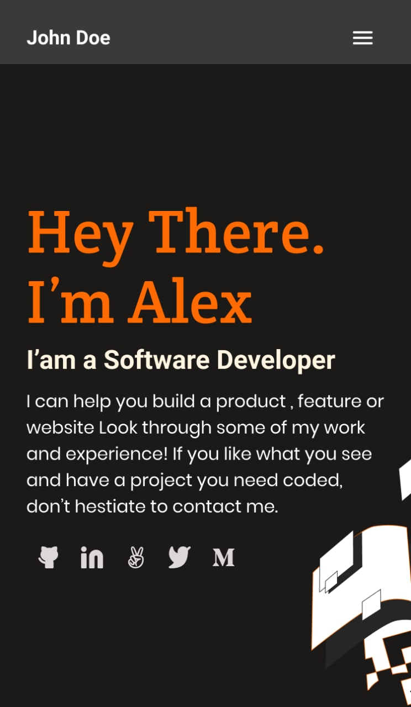

# My Portfolio

> Portfolio: setup and mobile first (Day 3 project)

The very first step to creating portfolio website is to design first page
of the mobile version based on the given templates.
My choice was the second template:

[Link to template in Figma](https://www.figma.com/file/l7SqJ3ZfkAKih9sFxvWSR4/Microverse-Student-Project-1?node-id=48%3A27)

## Built With

- HTML
- CSS

## Authors

👤 **Billy Mohajeri**

- GitHub: [@BillyMohajeri](https://github.com/billymohajeri)
- Twitter: [@BillyMohajeri](https://twitter.com/BillyMohajeri)
- LinkedIn: [@BillyMohajeri](https://www.linkedin.com/in/billymohajeri)

## 🤝 Contributing

Contributions, issues, and feature requests are welcome!

Feel free to check the [issues page](../../issues/).

## Show your support

Give a ⭐️ if you like this project!

## Acknowledgments

- Hat tip to anyone whose code was used
- Inspiration
- etc

## 📝 License

This project is [MIT](./LICENSE) licensed.

_NOTE: we recommend using the [MIT license](https://choosealicense.com/licenses/mit/) - you can set it up quickly by [using templates available on GitHub](https://docs.github.com/en/communities/setting-up-your-project-for-healthy-contributions/adding-a-license-to-a-repository). You can also use [any other license](https://choosealicense.com/licenses/) if you wish._
